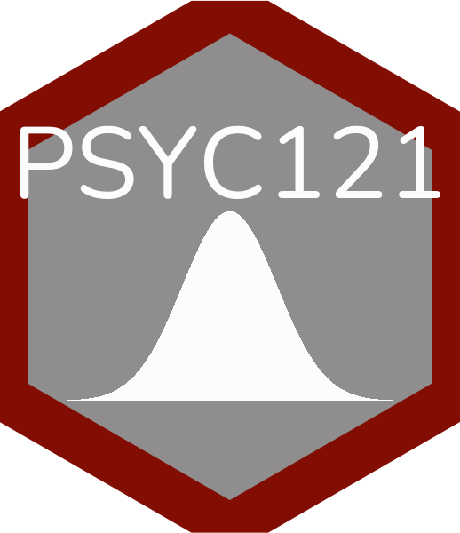

```{r include=FALSE}
library(hexSticker)
library(tidyverse)
library(showtext)
# Loading Google fonts (http://www.google.com/fonts)
font_add_google("Nunito")
# ## Automatically use showtext to render text for future devices
# showtext_auto()

```


# Department of Psychology - Lancaster University

This is the statistics content for the first- and second-year undergraduate psychology modules.

## Year 1

### Statistics for Psychologists 1 (PSYC121)

```{r warning=FALSE, include=FALSE}
# PSYC121
graph_121 <-
  ggplot(data.frame(x = c(-4, 4)), aes(x = x)) +
  stat_function(fun = dnorm, geom = "area", alpha = 1, fill = "#820d03") +
  theme_void()

PSYC121 <- sticker(subplot = graph_121,
              p_family = "Nunito",
              package = "PSYC121", p_size=24, p_color = "#3F8CCC",
              s_x=1, s_y=0.85, s_width=1.6, s_height=.8,
              h_size = 1.2, h_fill = "#FFF9F2", h_color = "#3F8CCC", dpi = 320, filename = "PSYC121.png")

# magick::image_read("man/figures/logo.png")

PSYC121


# PSYC122

x <-  sample(100,40)
y <- x + sample(250,40)

graph_122 <-
  ggplot(data = data.frame(x = x, y = y), aes(x = x, y = y)) +
    geom_point(colour = "#820d03", size = 1) +
  geom_smooth(method = "lm", colour = "#820d03", fill = "#3F8CCC") +
  theme_void()

PSYC122 <- sticker(subplot = graph_122,
              p_family = "Nunito",
              package = "PSYC122", p_size=24, p_color = "#3F8CCC",
              s_x=1, s_y=0.85, s_width=1.6, s_height=.8,
              h_size = 1.2, h_fill = "#FFF9F2", h_color = "#3F8CCC", dpi = 320, filename = "PSYC122.png")


PSYC122


#PSYC122


```

{width=250px height=300px} [Weeks 1-5](https://tombeesley.github.io/PSYC121_2021-22/index.html){target="_blank"}

[Week 6-10](https://tombeesley.github.io/PSYC121_2021-22/week-6-visualising-data-and-binomial-tests.html){target="_blank"}

### Statistics for Psychologists 2 (PSYC122)

[Weeks 1-5](https://mg78.github.io/lu_psyc122/){target="_blank"} 

[Week 6-10](https://robayedavies.github.io/PSYC122-part-2/){target="_blank"}

## Year 2

### PSYC214 

[Weeks 1-5] content to be added

[Week 6-10] content to be added

### PSYC234

[Weeks 1-5] **content to be added**

[Week 6-10](https://amy-atkinson.github.io/PSYC234_Part2/){target="_blank"}


